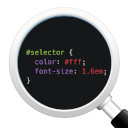

# Community Recommends: VSCode Extensions

Recently, I reached out to our community on the [NorDev Discord Server](https://discord.com/invite/WQwrYrS) to get some recommendations on extensions for VSCode. I already had a few in mind but I figured there's no better place to get some solid opions so here are the community recommendations.

## Prettier

[Prettier](https://marketplace.visualstudio.com/items?itemName=esbenp.prettier-vscode) is a code formatter, and a very popular one too!  
In their own words: 
> Prettier is an opinionated code formatter. It enforces a consistent style by parsing your code and re-printing it with its own rules that take the maximum line length into account, wrapping code when necessary.   

Now if you are new to coding and just starting out it may be worth skipping this one for a little while, just to ensure you learn best practices and don't become entirely reliant on a code formatter to keep your work legible.   
That said, the main reason this was chosen as a popular option by the community is the fact it allows you to worry less on the legibility of your code and instead focus more on the code itself.   
If you need to get in the zone and simply write the code without little worry or regard to formatting and other nuances then this is a great recommendation.  

## Live Server

[Live Server](https://marketplace.visualstudio.com/items?itemName=ritwickdey.LiveServer) is a fanstatic tool when you are working on sites that are comprised of nothing more than HTML, CSS and Javascript.   
Live Server provides you with a way to view your code as you would on, well, a live server. It auto updates as you save your code and is a great companion for a second screen (or split screen) set up so you can see the changes as you make them.   
As a new coder I found this to be really useful, I knew almost instantly that the changes I were making were either working or not. It's great for experimental learning.   

## Live Share

[Live Share](https://marketplace.visualstudio.com/items?itemName=MS-vsliveshare.vsliveshare-pack) is the definitive extension for sharing your projects and pair programming and working collaboratively remotely, all provided by Microsoft themselves.   
In their own words:
> This extension pack includes everything you need to start collaboratively editing and debugging in real time, including integrated audio and text chat. This provides you and your team/class with a one-click installation, in order to begin pair programming, performing remote code reviews, driving interactive lectures, and more, without needing to leave Visual Studio Code.   

I can't put it much better than that really, long story short, if you need a friend to help you with your code or you intend to pair programme, work collaboratively and want to work in real time then this the one for you.  
A strong choice from the community.   

## GitLens

[GitLens](https://marketplace.visualstudio.com/items?itemName=eamodio.gitlens) is an extension that adds extra features to Git.   
To quote the experts:
> Supercharge Git within VS Code — Visualize code authorship at a glance via Git blame annotations and CodeLens, seamlessly navigate and explore Git repositories, gain valuable insights via rich visualizations and powerful comparison commands, and so much more.   

Pretty self explanatory, not sure how else I can elaborate on that other than saying that it sure is a popular option and it comes from the trusty people at GitKraken, a little more from them below.

> GitLens supercharges Git inside VS Code and unlocks untapped knowledge within each repository. It helps you to visualize code authorship at a glance via Git blame annotations and CodeLens, seamlessly navigate and explore Git repositories, gain valuable insights via rich visualizations and powerful comparison commands, and so much more.   

That's all I'm saying other than check it out!   

## CSS Peek

[CSS Peek](https://marketplace.visualstudio.com/items?itemName=pranaygp.vscode-css-peek) is a favourite of mine beacuse I am a very ~lazy~ efficient person.   
CSS Peek allows you to, well, peek at your CSS. You can use it one a `class` in your HTML to see the CSS that it is appying. It does go one step further though and will allow you to edit the CSS from your peek without even opening your CSS file.   
When you're first applying classes it's great if you can remember exactly what your class does, when editing in future it's fantastic for those quick edits. It also lets you jump straight to the relevant part in the CSS file from your HTML document too.   

## JavaScript (ES6) code snippets

[JS Snippets](https://marketplace.visualstudio.com/items?itemName=xabikos.JavaScriptSnippets) does exactly what it says on the tin.   
This extension providers you with snippets of ES6 code, it also supports Typescript as well as Javascript and React too.  
A very handy little morsel!   

## Power Mode

[Power Mode](https://marketplace.visualstudio.com/items?itemName=hoovercj.vscode-power-mode) is the point at which we remember that the NorDev community has a good sense of humour.   
Power Mode has a number of features to add flair and meme's to your coding experience.   
There is a combo meter (keep those fingers tapping) as well as a variety of built-in effects including explosions, interdeminsional portals, and clippy (for the meme's) and over 20 customisable settings.   
I can't do it justice in text along, just click the link and prepare to have your mind blown!   

## And that's a wrap!
That is the list of all extensions that were recommended to me by the NorDev community.   
We'd love to hear any suggestions you have to please feel free to drop in, say Hi and let us know your favourites on the [NorDev Discord Server](https://discord.com/invite/WQwrYrS)!
